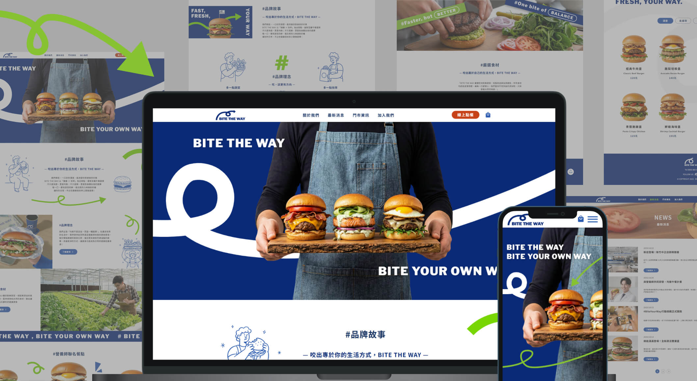
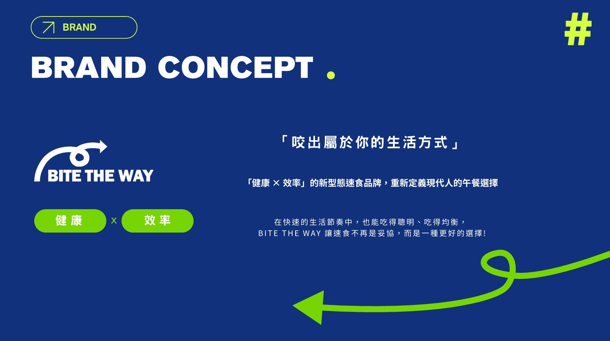

# BITE THE WAY - 新型態漢堡品牌網站

 

## 專案簡介

>BITE THE WAY 是一個新型態健康漢堡品牌。核心概念強調「蔬菜量 x 效率」，旨在解決現代人在「快速用餐」與「營養均衡」之間的取捨難題。

 

本專案展現了從設計到開發的完整工作流程，包含品牌識別建構、UI/UX 規劃、高擬真原型設計、AI 素材生成以及前端程式實作。網站採用響應式設計 (RWD)，確保在各種裝置上皆能提供流暢的使用者體驗。

## 技術堆疊

* **核心技術:** HTML, CSS, JavaScript
* **樣式與排版:** SCSS, CSS Grid, Flexbox, CSS Variables, RWD
* **第三方套件:**
    * **AOS.js:** 處理滾動視差與進場動畫。
    * **Swiper.js:** 應用於首頁漢堡輪播效果。
* **開發工具:** Git, VS Code, Chrome DevTools
* **設計與素材:** Figma, Adobe Illustrator, Adobe Photoshop Gemini (AI 圖像生成)

## 核心功能與技術亮點

### 1. 前端邏輯實作
* **動態金額試算:** 運用原生 JavaScript 實作購物車邏輯。系統能監聽「數量增減」與「加購選項 (Checkbox)」的 DOM 事件，即時計算並更新總金額，無須依賴後端刷新頁面。
* **單一 Modal 架構:** 採用 Event Delegation 與 HTML data-attributes 技術。全站僅使用一個 Modal 骨架，根據使用者點擊的商品動態渲染對應內容。此做法大幅減少了 DOM 節點數量與 HTML 冗餘代碼。

### 2. RWD 響應式設計與優化
* **跨裝置適配 (Cross-Device Compatibility):** 運用 CSS Media Queries 針對不同螢幕尺寸進行佈局調整。除了完善的桌機體驗外，也特別優化了行動裝置的介面配置，確保在各種裝置上皆能提供流暢且一致的使用者體驗。
* **跨瀏覽器兼容性:** 解決了 iOS Safari 特有的問題，例如網址列導致的 `100vh` 視窗高度計算錯誤，確保滿版視覺能正確呈現。
* **內捲動滿版彈窗:** 針對手機版開發了「內捲動」機制的 Modal，解決了原生捲動條在彈窗開啟時可能造成的背景滑動衝突。

## 網站架構與頁面細節

本網站包含 7 個主要區塊。下表詳細列出了各頁面的內容規劃與技術實作重點。

| 頁面 | 內容描述 | 技術與設計重點 |
| :--- | :--- | :--- |
| **首頁 (Home)** | - 品牌 Slogan 主視覺<br>- 品牌故事摘要<br>- 營養師聯名餐點推薦<br>- 最新消息預覽 | - **Swiper.js** 實作餐點輪播模組。<br>- **AOS.js** 設定滾動觸發的淡入與滑入動畫。 |
| **關於我們 (About)** | - 品牌理念「一口好的平衡」<br>- 嚴選食材透明化展示<br>- 品牌精神視覺化 | - 食材卡片採用 CSS Flex 互動效果，Hover 時會展開顯示細節。<br>- 視差滾動圖片設計。 |
| **最新消息 (News)** | - 新店開幕、新品上市活動列表<br>- 分頁切換介面 | - 採用 CSS Grid 進行卡片式排版。<br>- 類別篩選標籤功能。 |
| **線上點餐 (Order)** | - 完整菜單分類 (漢堡、能量碗、副餐、飲品)<br>- 餐點詳情與客製化選項 | - **核心功能:** 點擊商品卡片開啟動態 Modal。<br>- CSS Hover 效果實現產品圖片縮放。<br>- 菜單類別篩選器。 |
| **購物車 (Cart)** | - 訂單摘要 (僅限外帶自取)<br>- 取餐時間與門市選擇<br>- 付款方式選擇 | - **邏輯:** 依據加購配料即時更新價格。<br>- 日期選擇器限制 (僅能選擇有效日期)。 |
| **門市資訊 (Stores)** | - 門市列表與地圖<br>- 顧客服務聯絡表單<br>- 常見問題集 (FAQ) | - 手風琴 (Accordion) 收折效果的 FAQ 區塊。<br>- 表單輸入欄位驗證。 |
| **加入我們 (Join Us)** | - 人才招募資訊<br>- 企業文化介紹 | - 版面設計強調三大品牌價值：Brand, Quality, Efficiency。 |

## 設計系統與視覺識別

設計風格強調現代簡約，旨在平衡「信任感」與「活力感」。

### 色彩計畫
* **主色 (Deep Blue #0A2A78):** 用於主視覺、Logo 與標題，傳遞專業與信任感。
* **輔色 (Lime Green #78D604):** 用於點綴與裝飾，象徵健康、蔬菜與新鮮。
* **強調色 (Tomato Red #C74317):** 用於 CTA 按鈕 (如：立即點餐)，利用暖色調刺激食慾與點擊率。

### AI 技術應用
本專案運用生成式 AI (Gemini Nano Banana Pro) 解決個人開發缺乏專業攝影資源的問題。
* **應用範圍:** 生成高解析度的產品照 (漢堡、沙拉)、擬真的店面環境模擬圖，以及品牌包裝視覺。
* **工作流:** Prompt Engineering -> AI 生成 -> Photoshop 精修與去背 -> 網頁實作。

## 安裝與執行

1.  複製此專案 (Clone Repository):
    ```bash
    git clone [https://github.com/](https://github.com/)[你的帳號名稱]/bite-the-way.git
    ```
2.  使用程式碼編輯器開啟專案資料夾。
3.  建議使用 VS Code 的 "Live Server" 套件啟動專案，或直接使用瀏覽器開啟 `index.html` 檔案。

## 作者

**NLEE**
* 角色: UI/UX 設計師 & 前端開發者
* 專長: 前端邏輯實作, RWD 響應式設計, 視覺介面設計